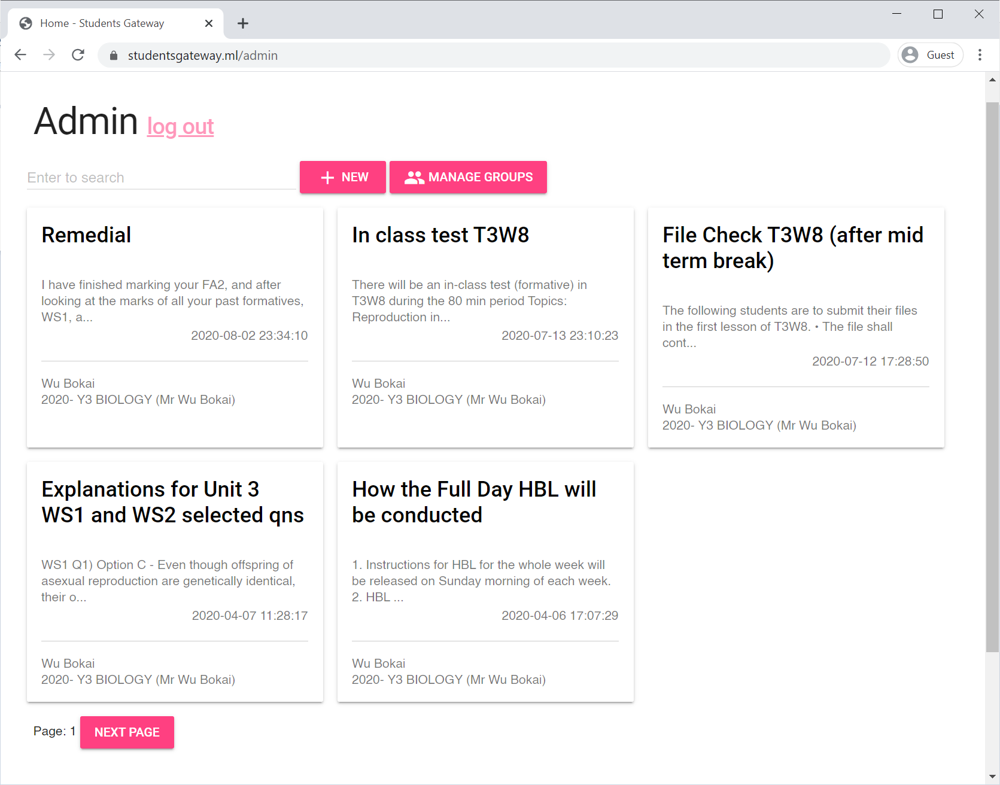
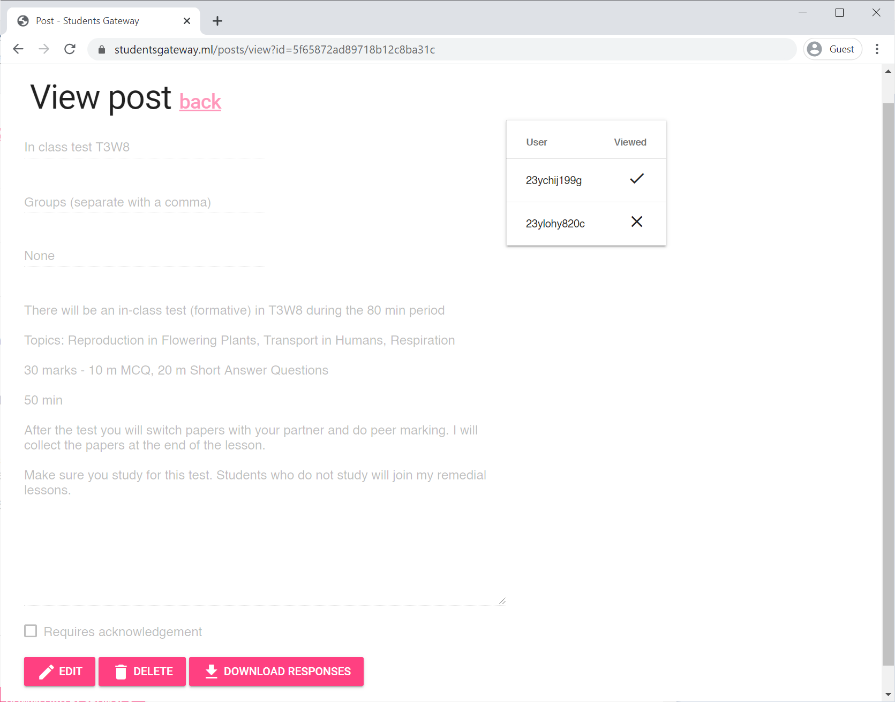

# 🎓 Students Gateway — Y3 CEP Final Project

[ Website/API | [App](https://github.com/Ycmelon/students-gateway-app) ]

Students' Gateway enables teachers to interact with students more conveniently on administrative matters.

## 📷 Screenshots

| Home page | Post view |
|-|-|
|  |  |

## 🚀 Features

WIP

## ⛏️ Installation

- On Play Store (hopefully)

## 📃  License

[GNU General Public License v3.0](https://choosealicense.com/licenses/gpl-3.0/)
